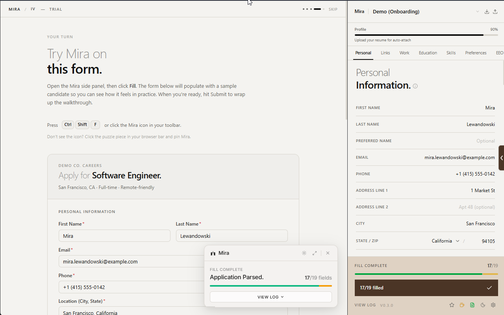
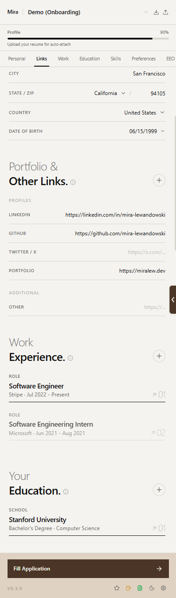
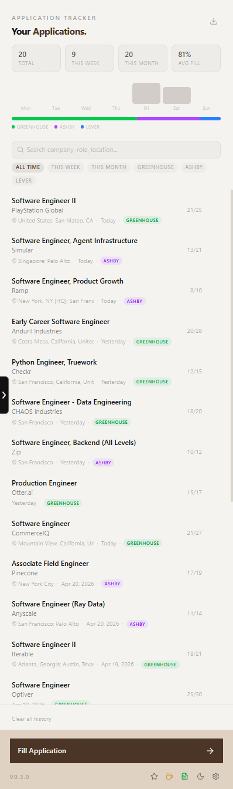
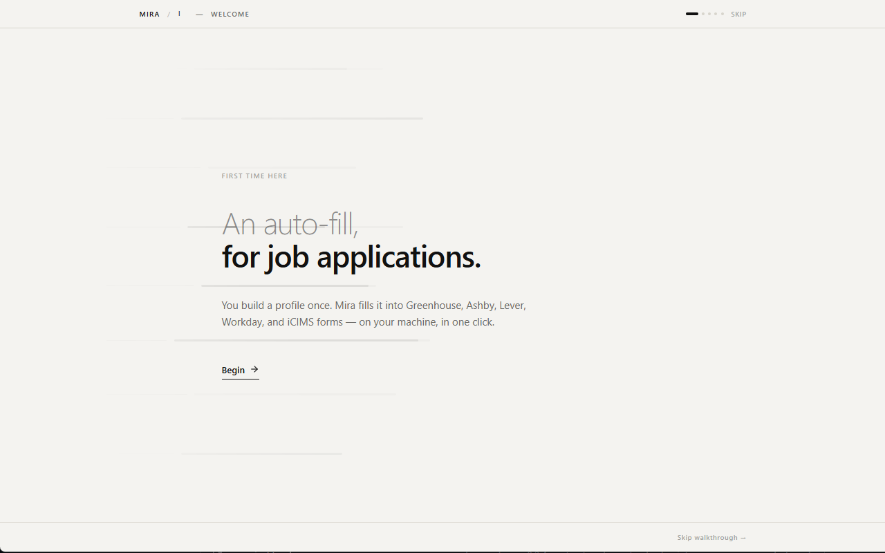

<p align="center">
  
</p>

<p align="center">
  
  
  
  
</p>

### A Chrome extension that auto-fills job applications on Ashby, Greenhouse, Lever, Workday, and iCIMS.

Stop retyping the same answers. Mira keeps your profile in your browser and fills application forms for you in one click — fully on-device, no servers, no tracking.

<p align="center">
  
</p>

## Install

### Chrome Web Store (recommended)

[**Install Mira**](https://chromewebstore.google.com/detail/nmanfejonnmcnldcpbjhcglbbhdglbpa) — one click, auto-updates.

### From a release build

1. Grab the latest `mira-chrome.zip` from the [Releases](https://github.com/hyunwoo312/mira/releases/latest) page.
2. Unzip it.
3. Open `chrome://extensions`, enable **Developer mode**, click **Load unpacked**, and select the unzipped folder.

### From source

```bash
git clone https://github.com/hyunwoo312/mira.git
cd mira
pnpm install
pnpm build
```

Then open `chrome://extensions`, enable **Developer mode**, click **Load unpacked**, and select `.output/chrome-mv3/`.

## Features

### One-click fill

Trigger from the side panel, the right-click menu, or **Ctrl+Shift+F** (⌘⇧F on Mac). Mira scans the page, classifies each field, and fills them in front of you — with a floating overlay that shows progress and a per-field log you can expand.

### On-device ML

A fine-tuned DeBERTa-v3-xsmall classifier runs entirely in your browser via WebAssembly (ONNX Runtime). It handles the messy stuff heuristics can't — sponsorship phrasing, EEO questions, consent checkboxes, custom screening prompts.

- No cloud inference · no API keys · no telemetry
- Model loads on first fill, unloads after 5 minutes idle
- ~38 MB model ships inside the extension

### Profile presets

Maintain separate profiles for different roles — e.g., "SWE" and "PM" — each with its own resume, cover letter, and answers. Switch between them from the top bar before filling.

<p align="center">
  
</p>

### Custom answer bank

Save your answers to recurring open-ended questions ("Why this company?", "Tell us about a project…") and Mira will reuse them on every form that asks something similar.

### Application tracker

Every fill is logged: company, role, URL, ATS, fill stats, timestamp. Browse your history, search by company, or clear it whenever you want.

<p align="center">
  
</p>

### Documents

Upload your resume and cover letter once per preset. Mira attaches them automatically when an application asks.

### Onboarding walkthrough

A guided five-phase tour walks you through the side panel, then hands you a sample candidate ("Mira Lewandowski") to try a real autofill on a demo form before you build your real profile. Replayable any time from Settings → Onboarding.

<p align="center">
  
</p>

### Privacy by design

- Everything stored in `chrome.storage.local` on your device
- No accounts, no servers, no analytics, no tracking
- Read the full [Privacy Policy](PRIVACY_POLICY.md)

### Supported sites

Greenhouse · Lever · Ashby · Workday · iCIMS, plus their iframe embeds on company career pages.

## Keyboard shortcuts

| Action                | Shortcut                                       |
| --------------------- | ---------------------------------------------- |
| Toggle the side panel | `Ctrl+Shift+E` (Windows / Linux) · `⌘⇧E` (Mac) |
| Fill the current page | `Ctrl+Shift+F` (Windows / Linux) · `⌘⇧F` (Mac) |

Re-bind from `chrome://extensions/shortcuts`.

## Development

```bash
pnpm dev          # hot-reload dev server
pnpm build        # production build
pnpm test         # run tests
pnpm typecheck    # type check
pnpm lint         # lint
```

The ML training pipeline lives in `ml/` — run `make -C ml retrain` for the end-to-end flow (augment → fine-tune → vocab-trim → ONNX export → quantize → regression eval).

## License

MIT
